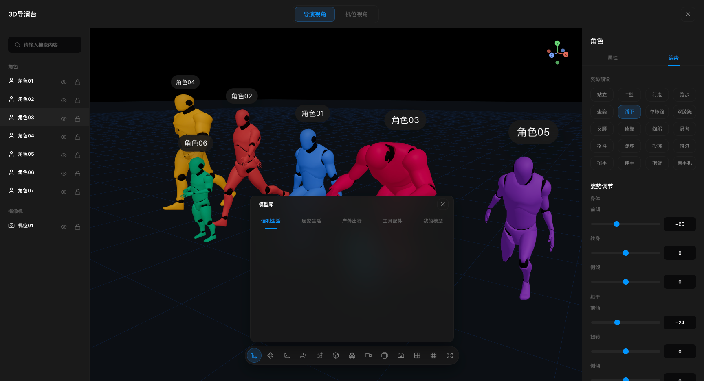
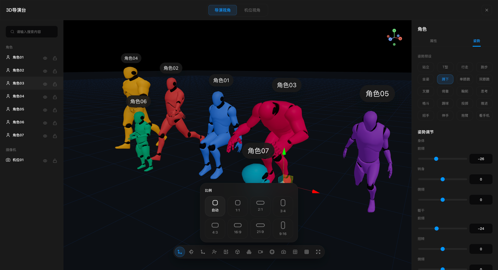
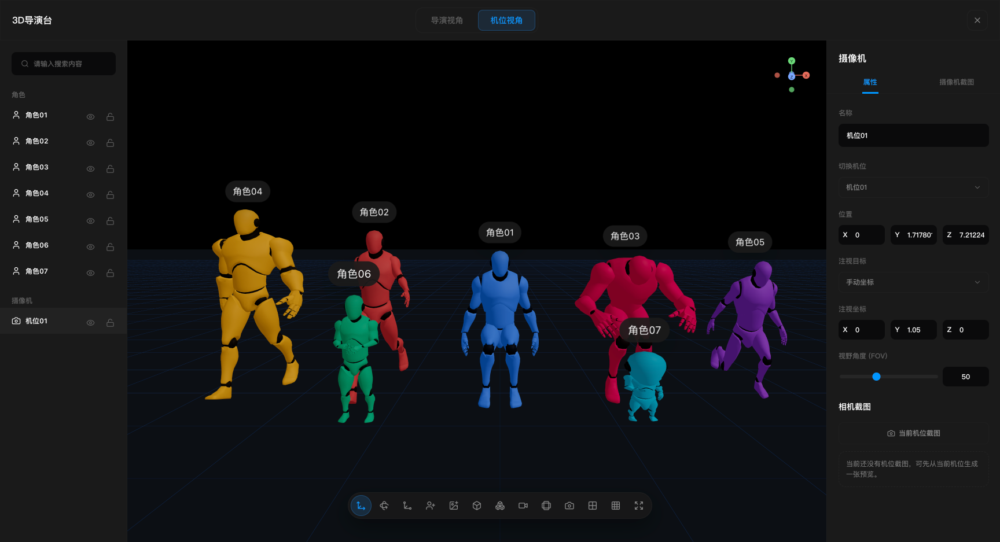

# 3D Director Desk

A 3D storyboarding director desk built with React, Vite, Three.js, and React Three Fiber. It's meant for lightweight previsualization, shot planning, and scene blocking — build characters, cameras, scenery, and panoramic backgrounds right in the browser, and quickly capture shots and screenshots.

## Feature overview

- Switch between director view and camera view
- 8 built-in character body types and 30 different poses
- Equip weapons (sword, dagger, axe, spear, staff, bow, rifle, pistol, shield) to a character's hand; they follow the pose and are adjustable (hand, grip offset/rotation, scale, color)
- Quickly add characters, crowds, geometric primitives, and cameras
- Import local FBX / OBJ / glTF (.glb/.gltf) models with a customizable model library
- Crowd arrays — add as many people as you want
- Panorama import and background adjustment
- Camera shots, screenshot capture, and basic shot management
- Aspect-ratio frame, rule-of-thirds grid, translate / rotate / scale controls
- Local scene state persistence

## Screenshots







## Tech stack

- React 18
- Vite 6
- TypeScript
- Three.js
- @react-three/fiber
- @react-three/drei
- Zustand
- Vitest

## Project structure

```text
src
├─ app/layout          # Top-level shell layout: canvas plus left/right sidebars
├─ editor/canvas       # Three.js / R3F viewport, frame overlay, toolbar, capture views
├─ editor/panels       # Left object tree and right property panels
├─ editor/store        # Zustand state, undo, and clipboard logic
├─ editor/io           # Screenshot export, project import/export, host messaging
├─ editor/loaders      # Local model and panorama import
├─ editor/runtime      # Character rendering, skeleton, and pose application
├─ editor/schema       # Data structures, camera and viewport definitions
└─ styles              # Global styles
```

## Local development

```bash
npm install
npm run dev
```

The default dev address is usually:

```text
http://127.0.0.1:5173/
```

If the port is taken, Vite automatically falls back to the next available one.

Preview the production build:

```bash
npm run preview
```

The default preview address is usually:

```text
http://127.0.0.1:4173/
```

## Common actions

- Toggle `Director View` and `Camera View` at the top
- The left panel is for searching, selecting, and browsing scene objects by group, with visibility / lock / delete
- The center viewport is for arranging the scene, switching transform modes, adding characters and cameras, importing assets, and capturing
- The right property panel automatically switches to the Scene / Character / Model / Camera editor based on the current selection

## Keyboard shortcuts

- `Ctrl/Cmd + C`: Copy the current selection
- `Ctrl/Cmd + V`: Paste the copied objects
- `Ctrl/Cmd + Z`: Undo the last action
- `Delete / Backspace`: Delete the current selection

## Data and embedding

- The current scene and local model library are written to the browser's `localStorage`
- You can export the project as JSON and re-import it from a file
- "Save latest project / Restore latest project" is supported
- The component includes a host-page messaging bridge, suitable for embedding into a larger authoring workbench

## Model library (local models)

Built-in library models are loaded from a `模型库` (model library) folder placed next to the project directory; the folder is optional and absent by default. The loader picks up `.fbx`, `.obj`, `.glb`, and `.gltf` files (glTF/GLB is recommended — it's the native three.js format and carries PBR materials and baked textures). To use it, create a `模型库` folder with the category subfolders referenced in `src/editor/modelLibrary/modelLibraryCatalog.ts`, or just use the in-app **Import local model** button, which stores models in `localStorage`.

Categories: `便利生活` (Convenience), `生活家居` (Home Living), `户外出行` (Outdoors), `工具配件` (Tools & Accessories), and `影视器材` (Film Equipment). To populate Film Equipment, drop models such as `studio_light.glb`, `c_stand.glb`, `camera_tripod.glb`, `boom_mic.glb`, or `clapperboard.glb` into `模型库/影视器材/` — the catalog maps those file names to friendly English labels. Each category can also hold a `缩略图/` (thumbnails) subfolder whose image names match the model display names.

## Build and test

Build:

```bash
npm run build
```

Test:

```bash
npm test
```

Most recent check:

- `npm run build` passes
- The build emits a few Vite warnings: some model-library thumbnail URLs are left for runtime resolution, and the main bundle exceeds the default chunk-size warning threshold
- `npm test` currently passes `304 / 312` cases; the remaining `8` failures are concentrated in the model-library panel, the viewport frame / axis hit zones, a couple of pose presets, and style assertions

## Notes

- This repository is primarily a source-code demo, suitable for extending into a more complete 3D director tool.
- The current version keeps the built-in character capabilities and supports importing local models and panoramas through the UI.
- If you publish work based on this project, please confirm the distribution licenses of any models, textures, and scene assets you add.

## License

MIT
